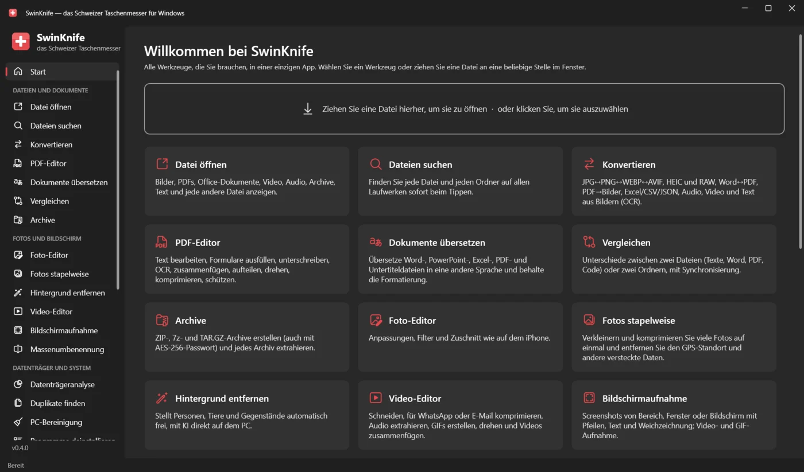
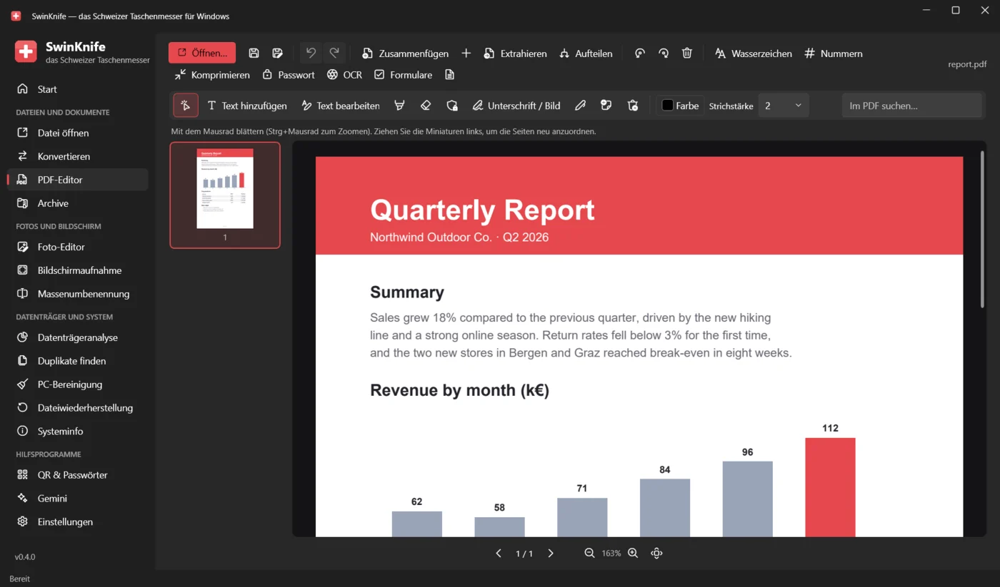
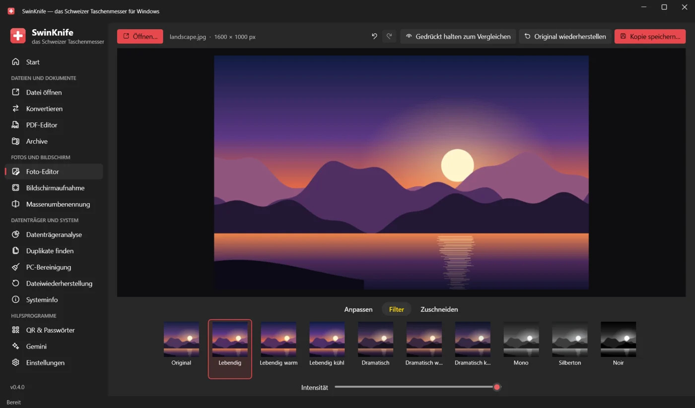
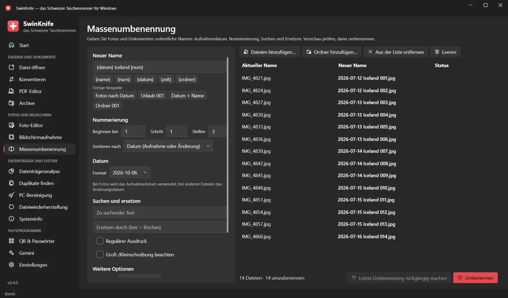
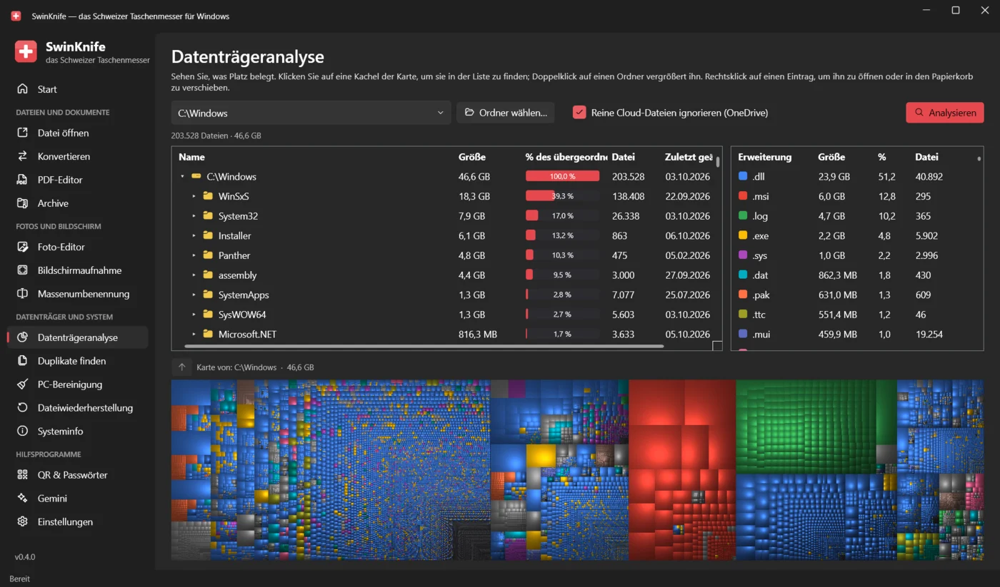

  

<h1 align="center">SwinKnife</h1>

  <b>Das Schweizer Taschenmesser für Windows.</b> 
  Jede Datei öffnen, konvertieren, PDFs und Fotos bearbeiten, den Bildschirm aufnehmen, Duplikate finden, gelöschte Dateien wiederherstellen und den PC aufräumen: alles in einer kostenlosen App.

  

  <a href="README.md">English</a> · <a href="README.it.md">Italiano</a> · <b>Deutsch</b> · <a href="README.es.md">Español</a> · <a href="README.fr.md">Français</a>

  

## Herunterladen und installieren

1. Öffne die **[neueste Version](../../releases/latest)** und lade **`SwinKnife-Setup-<Version>.exe`** herunter.
2. Starte die Datei. Administratorrechte sind nicht nötig; du kannst SwinKnife zum Rechtsklickmenü des Explorers hinzufügen.
3. Starte SwinKnife über das Startmenü.

> [!NOTE]
> Die App ist noch nicht digital signiert, deshalb kann Windows SmartScreen *„Der Computer wurde durch Windows geschützt“* anzeigen.
> Klicke auf **Weitere Informationen → Trotzdem ausführen**. Den Download kannst du mit `SHA256SUMS.txt` aus der Release prüfen.

- **Portable Version:** `SwinKnife-<Version>-portable.zip` herunterladen, irgendwo entpacken und `SwinKnife.exe` starten.
- **Aktualisieren:** das neue Setup herunterladen und über die alte Version installieren; die Einstellungen bleiben erhalten.
- **Deinstallieren:** *Einstellungen → Apps → Installierte Apps → SwinKnife*.

**Voraussetzungen:** Windows 10 (Version 1809 oder neuer) oder Windows 11, 64 Bit. Alles andere ist enthalten, auch .NET.
Optional: Microsoft Office oder LibreOffice, um Word-, Excel- und PowerPoint-Dateien zu konvertieren.
FFmpeg (Audio, Video, Bildschirmaufnahme) und 7-Zip (Erstellen von .7z-Archiven) werden beim ersten Bedarf automatisch heruntergeladen.

## Screenshots

<table>
  <tr>
    <td> <b>PDF-Editor</b>: Text bearbeiten, unterschreiben, Formulare ausfüllen, OCR, zusammenfügen und aufteilen</td>
    <td> <b>Foto-Editor</b>: Anpassungen, Filter und Zuschnitt wie auf dem iPhone</td>
  </tr>
  <tr>
    <td> <b>Massenumbenennung</b>: Aufnahmedatum, Nummerierung, Suchen und Ersetzen, mit Vorschau</td>
    <td> <b>Datenträgeranalyse</b>: sehen, was Platz belegt, mit einer Treemap</td>
  </tr>
</table>

## Was es kann

### Dateien und Dokumente
| Werkzeug | Funktion |
|---|---|
| **Datei öffnen** | Bilder (auch HEIC, AVIF, JPEG XL, PSD, RAW, animierte GIFs), PDF, XPS, Word/Excel/PowerPoint/ODT, CSV und XLSX als Tabelle, Text und Code mit Syntaxhervorhebung, Markdown/HTML mit Vorschau, SVG, Audio, Video, Archive, Schriftarten; alles andere hexadezimal. Dateidetails, MD5/SHA-256 und **Gemini fragen** (zusammenfassen, erklären, übersetzen, korrigieren). |
| **Konvertieren** | Bilder ↔ JPG/PNG/WEBP/AVIF/JPEG XL/BMP/GIF/TIFF/ICO/PDF · Word ↔ PDF/DOCX/ODT/RTF/TXT/HTML · PDF → Word/PNG/JPG/TXT · Excel/CSV/JSON · PowerPoint → PDF/Bilder · Markdown/HTML/TXT → PDF · Audio und Video · **OCR**: Bild → Text, gescanntes PDF → durchsuchbares PDF. |
| **PDF-Editor** | Vorhandenen Text bearbeiten, Text hinzufügen, Textmarker, Abdecken, Schwärzen, Unterschrift, Zeichnen, Notizen; **Formulare ausfüllen**; **OCR**; Seiten zusammenfügen, aufteilen, drehen und neu anordnen; Wasserzeichen, Seitenzahlen, Komprimierung, AES-256-Passwort; Rückgängig/Wiederholen. |
| **Archive** | ZIP (AES-256-Passwort), 7z (Inhalt und Namen verschlüsselt) und TAR.GZ erstellen; ZIP, 7z, RAR, TAR, GZ, BZ2, XZ entpacken, auch mit Passwort. |

### Fotos und Bildschirm
| Werkzeug | Funktion |
|---|---|
| **Foto-Editor** | Wie die Fotos-App des iPhone: *Anpassen* (15 Regler + Auto), *Filter*, *Zuschneiden*. Speichert eine Kopie und behält die EXIF-Daten. |
| **Bildschirmaufnahme** | Screenshots von einem Bereich, einem Fenster oder dem ganzen Bildschirm, mit Pfeilen, Formen, Textmarker, Text, nummerierten Schritten und Verpixeln vertraulicher Daten. Bildschirmaufnahme als **MP4** (mit Mikrofon) oder **GIF**. |
| **Massenumbenennung** | Vorlagen mit `{name}`, `{num}`, `{datum}` (Aufnahmedatum des Fotos), `{zeit}`, `{ordner}`; Suchen und Ersetzen (auch Regex), Groß-/Kleinschreibung, Erweiterungen, Akzente. Vorschau, Konfliktwarnungen, Rückgängig. |

### Datenträger und System
| Werkzeug | Funktion |
|---|---|
| **Datenträgeranalyse** | Wie WinDirStat: Ordner nach Größe, Statistik nach Dateityp und Treemap. Überspringt reine OneDrive-Cloud-Dateien. Als Administrator mit **Schnellmodus**: liest die NTFS-Dateitabelle direkt, wie WinDirStat und WizTree, und analysiert einen ganzen Datenträger in Sekunden. |
| **Duplikate finden** | Identische Dateien und **ähnliche Fotos** (erkennt verkleinerte oder bearbeitete Kopien). Wählt aus, was behalten wird, zeigt Vorschauen nebeneinander und verschiebt den Rest in den Papierkorb. |
| **PC-Bereinigung** | Temporäre Dateien, Papierkorb, Browser- und App-Caches, Miniaturansichten, Fehlerberichte, Reste von Windows Update. Zeigt, wie viel Platz frei wird, und die Dateiliste vor dem Löschen. |
| **Dateiwiederherstellung** | *Schnell, mit Originalnamen*: NTFS, FAT12/16/32 und exFAT. *Tiefenscan*: findet Dateien anhand ihres Inhalts, auch nach einer Formatierung. Nur lesend; funktioniert auch mit Datenträgerabbildern. |
| **Systeminfo** | Windows, CPU, RAM, Grafikkarte, Datenträger mit S.M.A.R.T.-Zustand, Akkuverschleiß und Ladezyklen, Netzwerk und WLAN, Autostart-Programme zum Ein- und Ausschalten, CPU- und Speicherauslastung live. |

### Hilfsprogramme
| Werkzeug | Funktion |
|---|---|
| **QR & Passwörter** | QR-Codes für Links, WLAN, Kontakte, E-Mail und SMS, als PNG oder SVG. Generator für sichere Passwörter und Stärkeprüfung, alles offline. |
| **Gemini** | Googles KI in einem integrierten Fenster, das angemeldet bleibt, oder in Chrome mit deinem Profil. |
| **Einstellungen** | Sprache, Rechtsklickmenü, Zusatzkomponenten, Datenordner und Fehlerprotokoll. |

Das **Rechtsklickmenü** im Explorer (unter Windows 11 in *Weitere Optionen anzeigen*) bietet schnellen Zugriff auf: öffnen, konvertieren,
zu einem Archiv hinzufügen und Gemini fragen für jede Datei; bearbeiten, komprimieren und OCR für PDFs; bearbeiten und konvertieren für Bilder;
hier entpacken für Archive; Speicher analysieren, Duplikate suchen, umbenennen und komprimieren für Ordner.

## Datenschutz

SwinKnife arbeitet offline auf deinem PC und sammelt keine Daten. Es geht nur online, um FFmpeg oder 7-Zip herunterzuladen,
wenn ein Werkzeug sie zum ersten Mal braucht, und wenn du Gemini verwendest, das deine Anfrage an Google sendet.
Einstellungen und Protokolle bleiben in `%LOCALAPPDATA%\SwinKnife`.

## Sprachen

SwinKnife gibt es auf Deutsch, Englisch, Italienisch, Spanisch und Französisch. Es verwendet die Sprache von Windows
(Englisch, falls deine noch fehlt), und du kannst sie in den *Einstellungen* ändern.
Eine holprige Übersetzung gefunden oder möchtest du deine Sprache hinzufügen? Siehe **[CONTRIBUTING.md](CONTRIBUTING.md#translations)** (auf Englisch): Es genügt, eine Textdatei zu bearbeiten.

## Für Entwickler

SwinKnife ist in **C# / WPF (.NET 10)** im Fluent-Design von Windows 11 geschrieben ([WPF-UI](https://github.com/lepoco/wpfui)).
Zum Kompilieren das .NET 10 SDK installieren und `build.bat` doppelklicken oder `dotnet run --project src/SwinKnife` ausführen.
Codeaufbau, neue Werkzeuge, Übersetzungen und Releases sind in **[CONTRIBUTING.md](CONTRIBUTING.md)** beschrieben.

## Lizenz

[MIT](LICENSE): frei nutzbar, veränderbar und weitergebbar.
