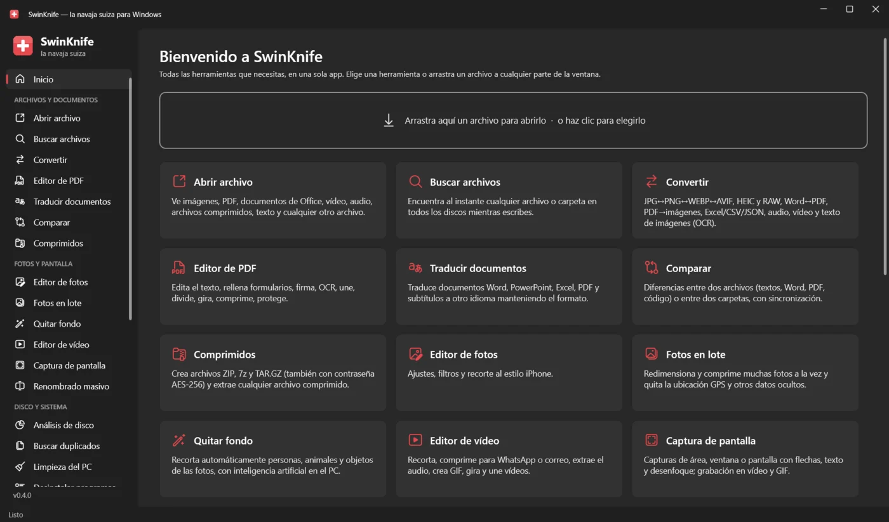
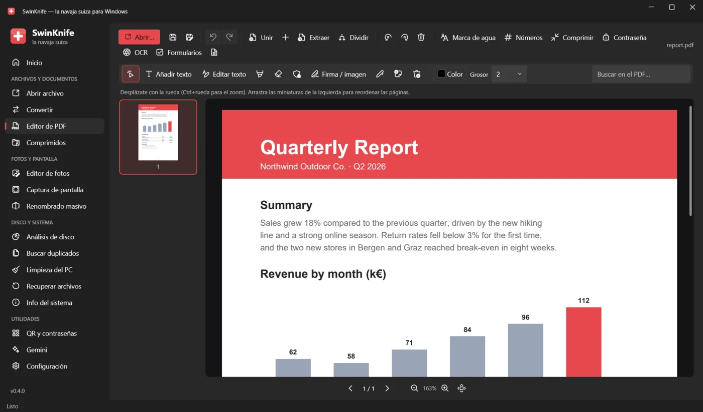
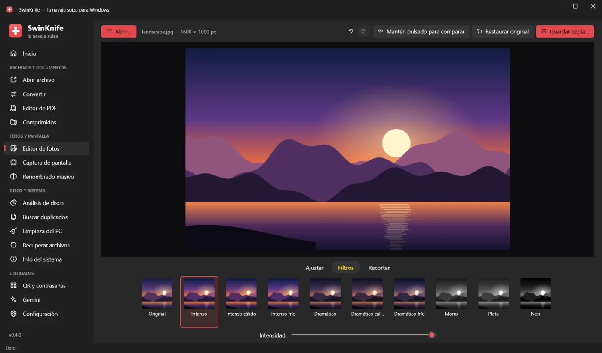
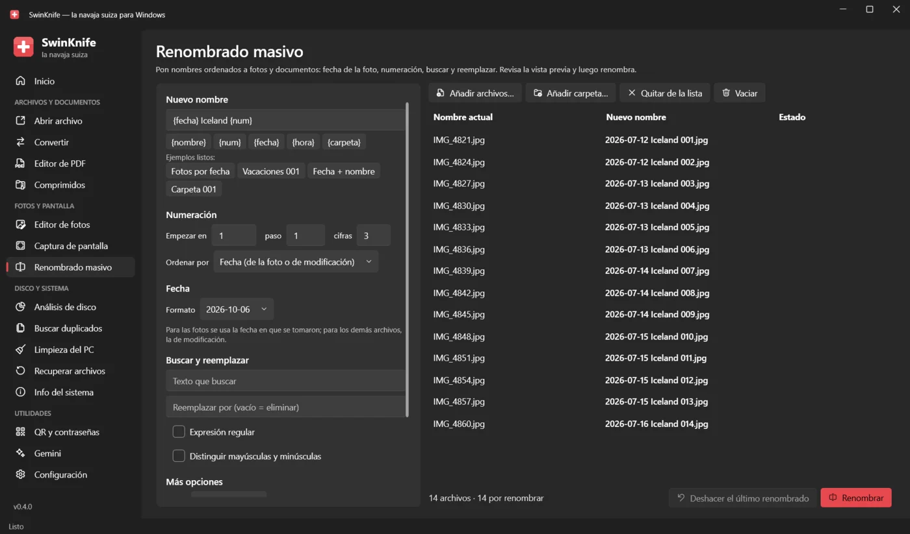
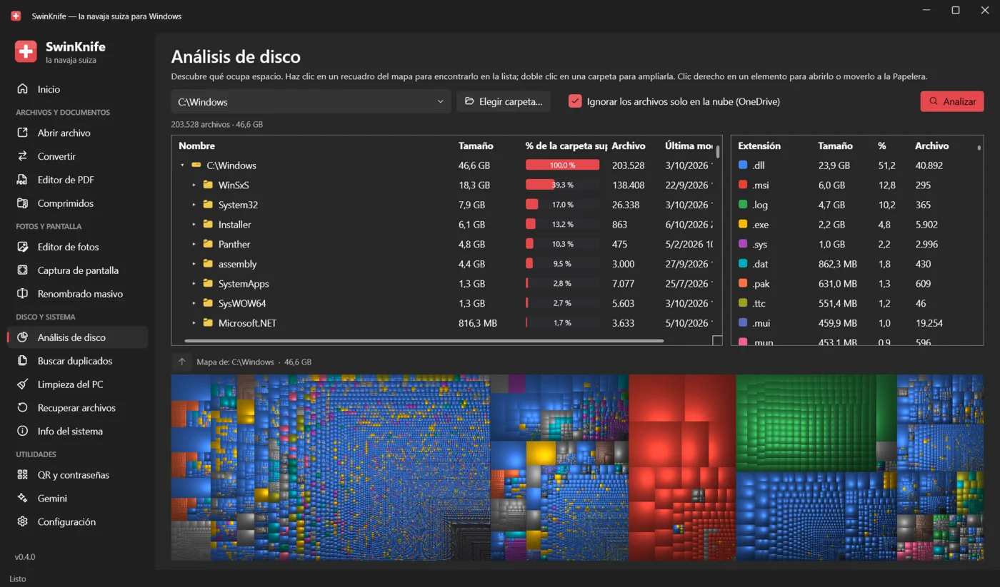

  

<h1 align="center">SwinKnife</h1>

  <b>La navaja suiza para Windows.</b> 
  Abre cualquier archivo, convierte, edita PDF y fotos, captura la pantalla, encuentra duplicados, recupera archivos eliminados y limpia tu PC: todo en una sola app gratuita.

  

  <a href="README.md">English</a> · <a href="README.it.md">Italiano</a> · <a href="README.de.md">Deutsch</a> · <b>Español</b> · <a href="README.fr.md">Français</a>

  

## Descarga e instalación

1. Abre la **[última versión](../../releases/latest)** y descarga **`SwinKnife-Setup-<versión>.exe`**.
2. Ejecútalo. No hacen falta permisos de administrador; puedes elegir añadir SwinKnife al menú contextual del Explorador de archivos.
3. Abre SwinKnife desde el menú Inicio.

> [!NOTE]
> La app todavía no tiene firma digital, así que Windows SmartScreen puede mostrar *«Windows protegió su PC»*.
> Haz clic en **Más información → Ejecutar de todas formas**. Puedes comprobar la descarga con `SHA256SUMS.txt` de la release.

- **Versión portable:** descarga `SwinKnife-<versión>-portable.zip`, extráelo donde quieras y ejecuta `SwinKnife.exe`.
- **Actualizar:** descarga el nuevo instalador e instálalo sobre la versión anterior; la configuración se conserva.
- **Desinstalar:** *Configuración → Aplicaciones → Aplicaciones instaladas → SwinKnife*.

**Requisitos:** Windows 10 (versión 1809 o posterior) o Windows 11, de 64 bits. Todo lo demás está incluido, también .NET.
Opcional: Microsoft Office o LibreOffice para convertir archivos de Word, Excel y PowerPoint.
FFmpeg (audio, vídeo, grabación de pantalla) y 7-Zip (creación de archivos .7z) se descargan solos la primera vez que se necesitan.

## Capturas

<table>
  <tr>
    <td> <b>Editor de PDF</b>: edita el texto, firma, rellena formularios, OCR, une y divide</td>
    <td> <b>Editor de fotos</b>: ajustes, filtros y recorte, como en el iPhone</td>
  </tr>
  <tr>
    <td> <b>Renombrado masivo</b>: fecha de la foto, numeración, buscar y reemplazar, con vista previa</td>
    <td> <b>Análisis de disco</b>: descubre qué ocupa espacio con un mapa</td>
  </tr>
</table>

## Qué puede hacer

### Archivos y documentos
| Herramienta | Qué hace |
|---|---|
| **Abrir archivo** | Imágenes (también HEIC, AVIF, JPEG XL, PSD, RAW, GIF animados), PDF, XPS, Word/Excel/PowerPoint/ODT, CSV y XLSX como tabla, texto y código con resaltado, Markdown/HTML con vista previa, SVG, audio, vídeo, archivos comprimidos, fuentes; todo lo demás en hexadecimal. Detalles del archivo, MD5/SHA-256 y **Preguntar a Gemini** (resumir, explicar, traducir, corregir). |
| **Convertir** | Imágenes ↔ JPG/PNG/WEBP/AVIF/JPEG XL/BMP/GIF/TIFF/ICO/PDF · Word ↔ PDF/DOCX/ODT/RTF/TXT/HTML · PDF → Word/PNG/JPG/TXT · Excel/CSV/JSON · PowerPoint → PDF/imágenes · Markdown/HTML/TXT → PDF · audio y vídeo · **OCR**: imagen → texto, PDF escaneado → PDF con búsqueda. |
| **Editor de PDF** | Editar el texto existente, añadir texto, resaltador, corrector, ocultación, firma, dibujo, notas; **rellenar formularios**; **OCR**; unir, dividir, girar y reordenar páginas; marca de agua, números de página, compresión, contraseña AES-256; deshacer/rehacer. |
| **Comprimidos** | Crea ZIP (contraseña AES-256), 7z (contenido y nombres cifrados) y TAR.GZ; extrae ZIP, 7z, RAR, TAR, GZ, BZ2, XZ, también con contraseña. |

### Fotos y pantalla
| Herramienta | Qué hace |
|---|---|
| **Editor de fotos** | Como la app Fotos del iPhone: *Ajustar* (15 controles + Auto), *Filtros*, *Recortar*. Guarda una copia y conserva los datos EXIF. |
| **Captura de pantalla** | Capturas de un área, una ventana o la pantalla completa, con flechas, formas, resaltador, texto, pasos numerados y pixelado para los datos sensibles. Grabación de pantalla en **MP4** (con micrófono) o **GIF**. |
| **Renombrado masivo** | Plantillas con `{nombre}`, `{num}`, `{fecha}` (fecha en que se tomó la foto), `{hora}`, `{carpeta}`; buscar y reemplazar (también regex), mayúsculas/minúsculas, extensiones, acentos. Vista previa, avisos de conflictos, deshacer. |

### Disco y sistema
| Herramienta | Qué hace |
|---|---|
| **Análisis de disco** | Como WinDirStat: carpetas por tamaño, estadísticas por tipo de archivo y mapa de árbol. Omite los archivos de OneDrive que están solo en la nube. Como administrador usa el **modo rápido**: lee directamente la tabla de archivos de NTFS, como WinDirStat y WizTree, y analiza un disco entero en segundos. |
| **Buscar duplicados** | Archivos idénticos y **fotos parecidas** (reconoce copias redimensionadas o retocadas). Elige por ti qué conservar, muestra las vistas previas lado a lado y envía el resto a la Papelera. |
| **Limpieza del PC** | Archivos temporales, Papelera, caché de navegadores y apps, miniaturas, informes de errores, restos de Windows Update. Muestra cuánto espacio recuperas y la lista de archivos antes de eliminarlos. |
| **Recuperar archivos** | *Rápido, con los nombres originales*: NTFS, FAT12/16/32 y exFAT. *Análisis profundo*: encuentra archivos por su contenido, incluso después de formatear. Solo lectura; funciona también con imágenes de disco. |
| **Info del sistema** | Windows, CPU, RAM, tarjeta gráfica, discos con estado S.M.A.R.T., desgaste y ciclos de la batería, red y Wi-Fi, programas de inicio que puedes activar o desactivar, uso de CPU y memoria en tiempo real. |

### Utilidades
| Herramienta | Qué hace |
|---|---|
| **QR y contraseñas** | Códigos QR para enlaces, Wi-Fi, contactos, correo y SMS, en PNG o SVG. Generador de contraseñas seguras y comprobación de su seguridad, todo sin conexión. |
| **Gemini** | La IA de Google en un panel integrado que mantiene la sesión, o en Chrome con tu perfil. |
| **Configuración** | Idioma, menú contextual, componentes adicionales, carpeta de datos y registro de errores. |

El **menú contextual** del Explorador (en Windows 11 en *Mostrar más opciones*) da acceso rápido a: abrir, convertir,
añadir a un archivo comprimido y preguntar a Gemini para cualquier archivo; editar, comprimir y OCR para PDF; editar y convertir para imágenes;
extraer aquí para archivos comprimidos; analizar el espacio, buscar duplicados, renombrar y comprimir para carpetas.

## Privacidad

SwinKnife funciona sin conexión en tu PC y no recopila datos. Solo se conecta a Internet para descargar FFmpeg o 7-Zip
la primera vez que una herramienta los necesita, y cuando usas Gemini, que envía tu petición a Google.
La configuración y los registros se quedan en `%LOCALAPPDATA%\SwinKnife`.

## Idiomas

SwinKnife está disponible en español, inglés, italiano, alemán y francés. Usa el idioma de Windows
(inglés si el tuyo todavía no está) y puedes cambiarlo en *Configuración*.
¿Has encontrado una traducción mejorable o quieres añadir tu idioma? Consulta **[CONTRIBUTING.md](CONTRIBUTING.md#translations)** (en inglés): basta con editar un archivo de texto.

## Para desarrolladores

SwinKnife está escrito en **C# / WPF (.NET 10)** con el diseño Fluent de Windows 11 ([WPF-UI](https://github.com/lepoco/wpfui)).
Para compilarlo, instala el .NET 10 SDK y haz doble clic en `build.bat`, o ejecuta `dotnet run --project src/SwinKnife`.
La estructura del código, cómo añadir una herramienta, las traducciones y la publicación de versiones se explican en **[CONTRIBUTING.md](CONTRIBUTING.md)**.

## Licencia

[MIT](LICENSE): puedes usarlo, modificarlo y compartirlo libremente.
