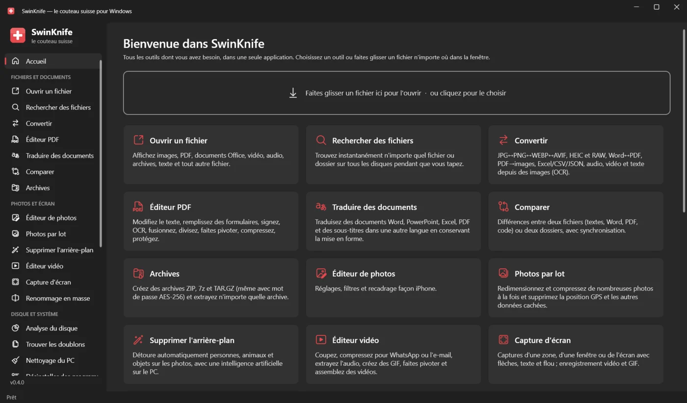
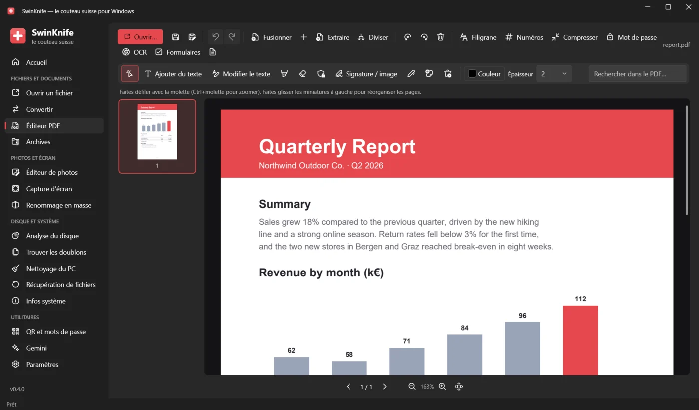
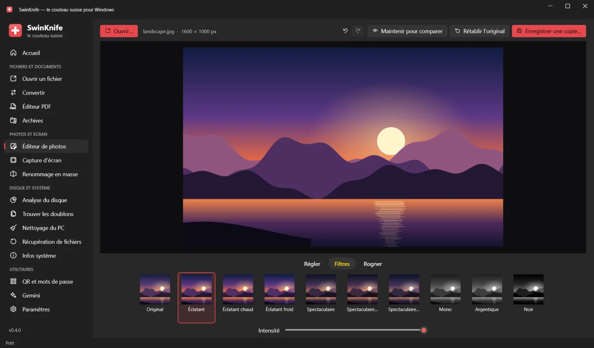
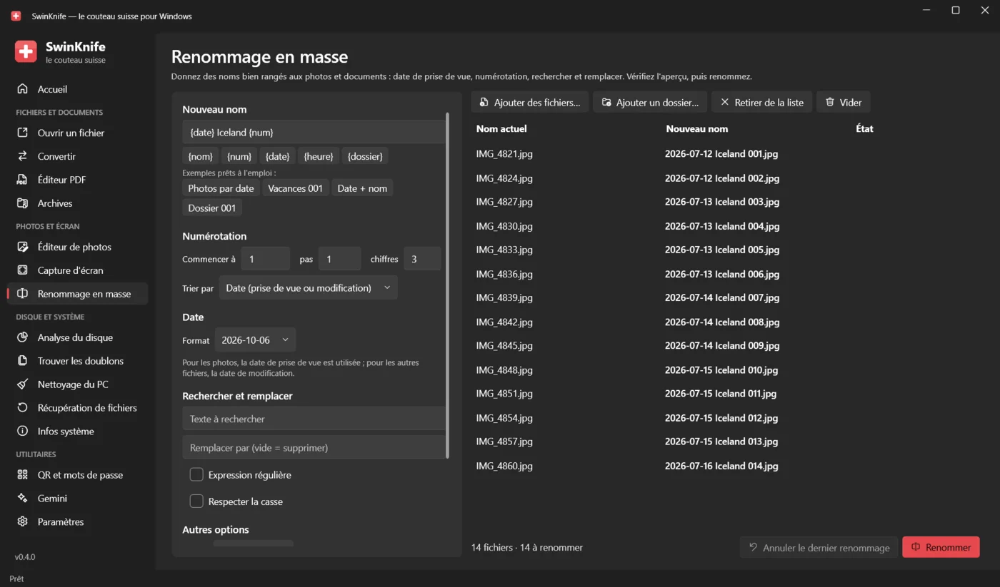
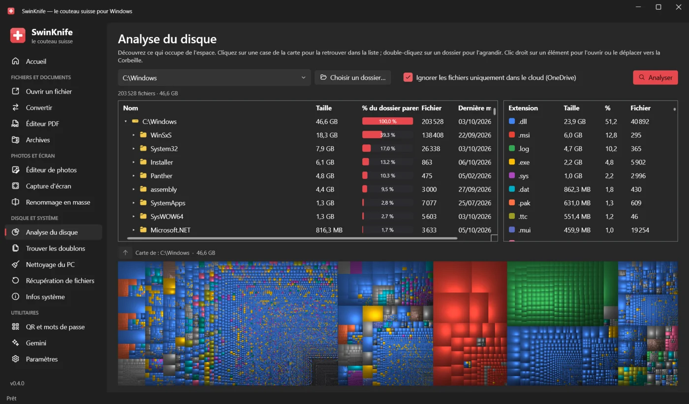

  

<h1 align="center">SwinKnife</h1>

  <b>Le couteau suisse pour Windows.</b> 
  Ouvrez n'importe quel fichier, convertissez, modifiez PDF et photos, capturez l'écran, trouvez les doublons, récupérez les fichiers supprimés et faites le ménage dans votre PC : le tout dans une seule application gratuite.

  

  <a href="README.md">English</a> · <a href="README.it.md">Italiano</a> · <a href="README.de.md">Deutsch</a> · <a href="README.es.md">Español</a> · <b>Français</b>

  

## Télécharger et installer

1. Ouvrez la **[dernière version](../../releases/latest)** et téléchargez **`SwinKnife-Setup-<version>.exe`**.
2. Lancez-le. Aucun droit d'administrateur n'est nécessaire ; vous pouvez ajouter SwinKnife au menu contextuel de l'Explorateur de fichiers.
3. Ouvrez SwinKnife depuis le menu Démarrer.

> [!NOTE]
> L'application n'a pas encore de signature numérique, Windows SmartScreen peut donc afficher *« Windows a protégé votre ordinateur »*.
> Cliquez sur **Informations complémentaires → Exécuter quand même**. Vous pouvez vérifier le téléchargement avec `SHA256SUMS.txt` de la release.

- **Version portable :** téléchargez `SwinKnife-<version>-portable.zip`, extrayez-le où vous voulez et lancez `SwinKnife.exe`.
- **Mettre à jour :** téléchargez le nouvel installateur et installez-le par-dessus l'ancienne version ; les paramètres sont conservés.
- **Désinstaller :** *Paramètres → Applications → Applications installées → SwinKnife*.

**Configuration requise :** Windows 10 (version 1809 ou ultérieure) ou Windows 11, 64 bits. Tout le reste est inclus, .NET aussi.
Facultatif : Microsoft Office ou LibreOffice pour convertir les fichiers Word, Excel et PowerPoint.
FFmpeg (audio, vidéo, enregistrement de l'écran) et 7-Zip (création d'archives .7z) sont téléchargés automatiquement la première fois qu'ils sont nécessaires.

## Captures d'écran

<table>
  <tr>
    <td> <b>Éditeur PDF</b> : modifier le texte, signer, remplir des formulaires, OCR, fusionner et diviser</td>
    <td> <b>Éditeur de photos</b> : réglages, filtres et recadrage, comme sur l'iPhone</td>
  </tr>
  <tr>
    <td> <b>Renommage en masse</b> : date de prise de vue, numérotation, rechercher et remplacer, avec aperçu</td>
    <td> <b>Analyse du disque</b> : voir ce qui prend de la place grâce à une carte</td>
  </tr>
</table>

## Ce qu'il sait faire

### Fichiers et documents
| Outil | Ce qu'il fait |
|---|---|
| **Ouvrir un fichier** | Images (aussi HEIC, AVIF, JPEG XL, PSD, RAW, GIF animés), PDF, XPS, Word/Excel/PowerPoint/ODT, CSV et XLSX en tableau, texte et code avec coloration syntaxique, Markdown/HTML avec aperçu, SVG, audio, vidéo, archives, polices ; tout le reste en hexadécimal. Détails du fichier, MD5/SHA-256 et **Interroger Gemini** (résumer, expliquer, traduire, corriger). |
| **Convertir** | Images ↔ JPG/PNG/WEBP/AVIF/JPEG XL/BMP/GIF/TIFF/ICO/PDF · Word ↔ PDF/DOCX/ODT/RTF/TXT/HTML · PDF → Word/PNG/JPG/TXT · Excel/CSV/JSON · PowerPoint → PDF/images · Markdown/HTML/TXT → PDF · audio et vidéo · **OCR** : image → texte, PDF numérisé → PDF interrogeable. |
| **Éditeur PDF** | Modifier le texte existant, ajouter du texte, surligneur, correcteur, caviardage, signature, dessin, notes ; **remplissage de formulaires** ; **OCR** ; fusionner, diviser, faire pivoter et réorganiser les pages ; filigrane, numéros de page, compression, mot de passe AES-256 ; annuler/rétablir. |
| **Archives** | Crée des ZIP (mot de passe AES-256), 7z (contenu et noms chiffrés) et TAR.GZ ; extrait ZIP, 7z, RAR, TAR, GZ, BZ2, XZ, même protégés par mot de passe. |

### Photos et écran
| Outil | Ce qu'il fait |
|---|---|
| **Éditeur de photos** | Comme l'app Photos de l'iPhone : *Régler* (15 curseurs + Auto), *Filtres*, *Recadrer*. Enregistre une copie et conserve les données EXIF. |
| **Capture d'écran** | Captures d'une zone, d'une fenêtre ou de tout l'écran, avec flèches, formes, surligneur, texte, étapes numérotées et pixellisation des données sensibles. Enregistrement de l'écran en **MP4** (avec micro) ou en **GIF**. |
| **Renommage en masse** | Modèles avec `{nom}`, `{num}`, `{date}` (date de prise de vue), `{heure}`, `{dossier}` ; rechercher et remplacer (regex aussi), casse, extensions, accents. Aperçu, conflits signalés, annulation. |

### Disque et système
| Outil | Ce qu'il fait |
|---|---|
| **Analyse du disque** | Comme WinDirStat : dossiers par taille, statistiques par type de fichier et carte proportionnelle. Ignore les fichiers OneDrive uniquement dans le cloud. En administrateur, **mode rapide** : lit directement la table des fichiers NTFS, comme WinDirStat et WizTree, et analyse un disque entier en quelques secondes. |
| **Trouver les doublons** | Fichiers identiques et **photos similaires** (reconnaît les copies redimensionnées ou retouchées). Choisit pour vous ce qu'il faut garder, affiche les aperçus côte à côte et déplace le reste vers la Corbeille. |
| **Nettoyage du PC** | Fichiers temporaires, Corbeille, caches des navigateurs et des applications, miniatures, rapports d'erreurs, restes de Windows Update. Indique l'espace récupéré et la liste des fichiers avant suppression. |
| **Récupération de fichiers** | *Rapide, avec les noms d'origine* : NTFS, FAT12/16/32 et exFAT. *Analyse approfondie* : retrouve les fichiers d'après leur contenu, même après un formatage. Lecture seule ; fonctionne aussi sur des images disque. |
| **Infos système** | Windows, CPU, RAM, carte graphique, disques avec état S.M.A.R.T., usure et cycles de la batterie, réseau et Wi-Fi, programmes au démarrage à activer ou désactiver, utilisation du CPU et de la mémoire en temps réel. |

### Utilitaires
| Outil | Ce qu'il fait |
|---|---|
| **QR et mots de passe** | QR codes pour liens, Wi-Fi, contacts, e-mail et SMS, en PNG ou SVG. Générateur de mots de passe sûrs et vérification de leur robustesse, entièrement hors ligne. |
| **Gemini** | L'IA de Google dans un panneau intégré qui reste connecté, ou dans Chrome avec votre profil. |
| **Paramètres** | Langue, menu contextuel, composants supplémentaires, dossier de données et journal des erreurs. |

Le **menu contextuel** de l'Explorateur (sous Windows 11 dans *Afficher d'autres options*) donne un accès rapide à : ouvrir, convertir,
ajouter à une archive et interroger Gemini pour tout fichier ; modifier, compresser et OCR pour les PDF ; modifier et convertir pour les images ;
extraire ici pour les archives ; analyser l'espace, rechercher les doublons, renommer et compresser pour les dossiers.

## Confidentialité

SwinKnife fonctionne hors ligne sur votre PC et ne collecte aucune donnée. Il ne se connecte à Internet que pour télécharger FFmpeg ou 7-Zip
la première fois qu'un outil en a besoin, et lorsque vous utilisez Gemini, qui envoie votre demande à Google.
Les paramètres et les journaux restent dans `%LOCALAPPDATA%\SwinKnife`.

## Langues

SwinKnife est disponible en français, anglais, italien, allemand et espagnol. Il utilise la langue de Windows
(l'anglais si la vôtre n'est pas encore disponible) et vous pouvez la changer dans les *Paramètres*.
Une traduction maladroite, ou envie d'ajouter votre langue ? Consultez **[CONTRIBUTING.md](CONTRIBUTING.md#translations)** (en anglais) : il suffit de modifier un fichier texte.

## Pour les développeurs

SwinKnife est écrit en **C# / WPF (.NET 10)** avec le style Fluent de Windows 11 ([WPF-UI](https://github.com/lepoco/wpfui)).
Pour le compiler, installez le SDK .NET 10 et double-cliquez sur `build.bat`, ou lancez `dotnet run --project src/SwinKnife`.
La structure du code, l'ajout d'un outil, les traductions et la publication des versions sont expliqués dans **[CONTRIBUTING.md](CONTRIBUTING.md)**.

## Licence

[MIT](LICENSE) : libre d'utilisation, de modification et de partage.
