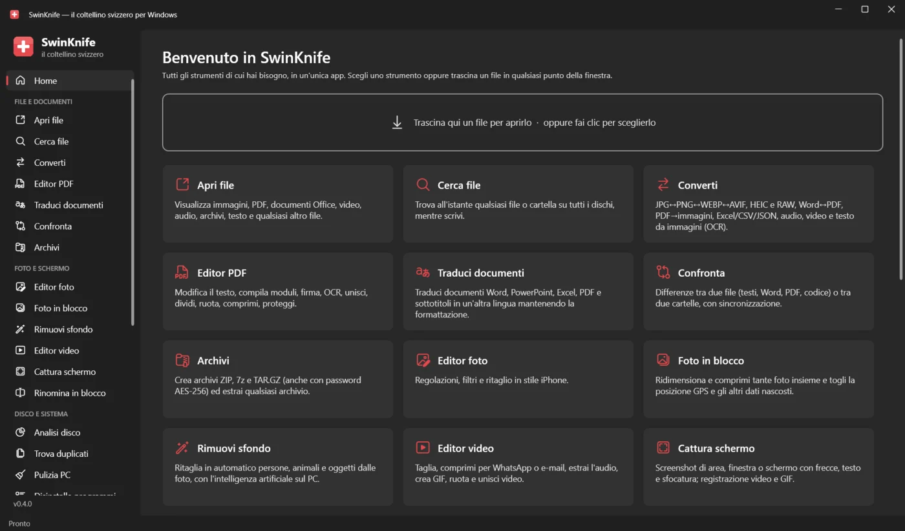
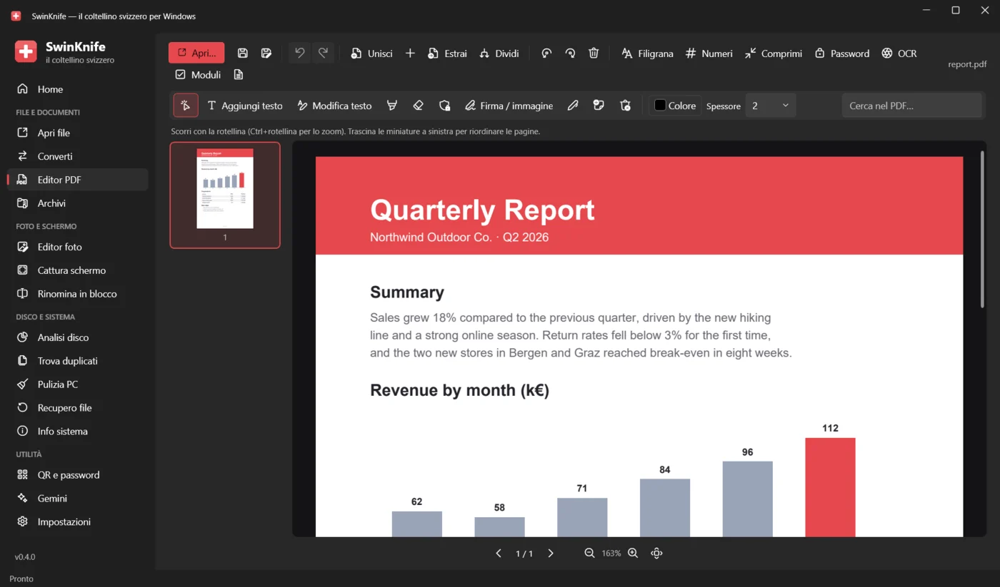
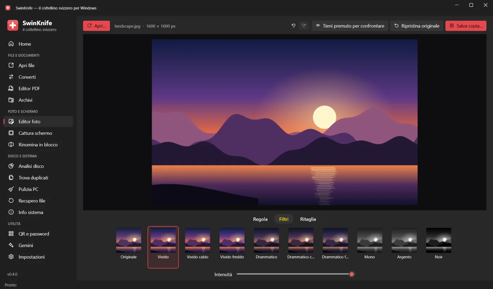
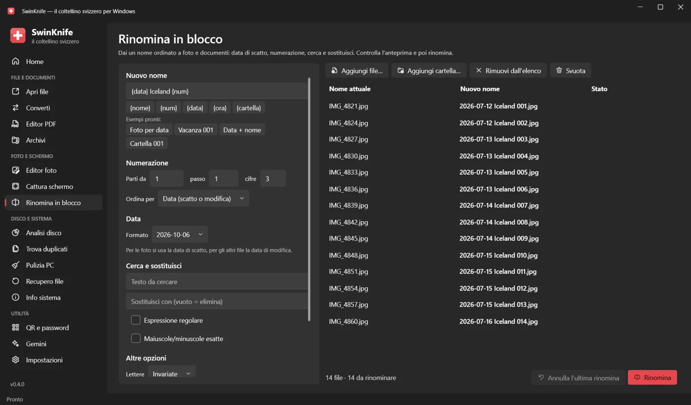
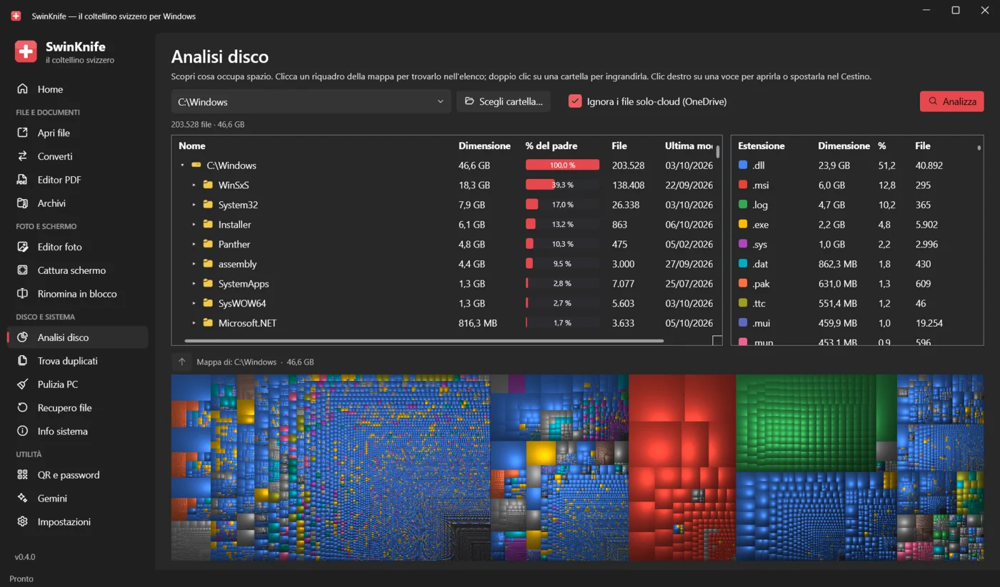

  

<h1 align="center">SwinKnife</h1>

  <b>Il coltellino svizzero per Windows.</b> 
  Apri qualsiasi file, converti, modifica PDF e foto, cattura lo schermo, trova i duplicati, recupera i file cancellati e fai pulizia nel PC: tutto in un'unica app gratuita.

  

  <a href="README.md">English</a> · <b>Italiano</b> · <a href="README.de.md">Deutsch</a> · <a href="README.es.md">Español</a> · <a href="README.fr.md">Français</a>

  

## Scarica e installa

1. Apri l'**[ultima versione](../../releases/latest)** e scarica **`SwinKnife-Setup-<versione>.exe`**.
2. Avvialo. Non servono permessi di amministratore; puoi scegliere di aggiungere SwinKnife al menu del tasto destro di Esplora file.
3. Apri SwinKnife dal menu Start.

> [!NOTE]
> L'app non ha ancora una firma digitale, quindi Windows SmartScreen può mostrare *"PC protetto da Windows"*.
> Fai clic su **Ulteriori informazioni → Esegui comunque**. Puoi verificare il file scaricato con `SHA256SUMS.txt` della release.

- **Versione portable:** scarica `SwinKnife-<versione>-portable.zip`, estrailo dove vuoi e avvia `SwinKnife.exe`.
- **Aggiornare:** scarica il nuovo setup e installalo sopra la versione precedente; le impostazioni restano.
- **Disinstallare:** *Impostazioni → App → App installate → SwinKnife*.

**Requisiti:** Windows 10 (versione 1809 o successiva) o Windows 11, a 64 bit. Tutto il resto è incluso, anche .NET.
Facoltativo: Microsoft Office o LibreOffice per convertire file Word, Excel e PowerPoint.
FFmpeg (audio, video, registrazione dello schermo) e 7-Zip (creazione di archivi .7z) vengono scaricati da soli la prima volta che servono.

## Schermate

<table>
  <tr>
    <td> <b>Editor PDF</b>: modifica il testo, firma, compila moduli, OCR, unisci e dividi</td>
    <td> <b>Editor foto</b>: regolazioni, filtri e ritaglio, come su iPhone</td>
  </tr>
  <tr>
    <td> <b>Rinomina in blocco</b>: data di scatto, numerazione, cerca e sostituisci, con anteprima</td>
    <td> <b>Analisi disco</b>: scopri cosa occupa spazio con una mappa</td>
  </tr>
</table>

## Cosa sa fare

### File e documenti
| Strumento | Cosa fa |
|---|---|
| **Apri file** | Immagini (anche HEIC, AVIF, JPEG XL, PSD, RAW, GIF animate), PDF, XPS, Word/Excel/PowerPoint/ODT, CSV e XLSX come tabella, testo e codice con evidenziazione, Markdown/HTML con anteprima, SVG, audio, video, archivi, font; tutto il resto in esadecimale. Dettagli del file, MD5/SHA-256 e **Chiedi a Gemini** (riassumi, spiega, traduci, correggi). |
| **Converti** | Immagini ↔ JPG/PNG/WEBP/AVIF/JPEG XL/BMP/GIF/TIFF/ICO/PDF · Word ↔ PDF/DOCX/ODT/RTF/TXT/HTML · PDF → Word/PNG/JPG/TXT · Excel/CSV/JSON · PowerPoint → PDF/immagini · Markdown/HTML/TXT → PDF · audio e video · **OCR**: immagine → testo, PDF scansionato → PDF ricercabile. |
| **Editor PDF** | Modifica del testo esistente, aggiunta di testo, evidenziatore, bianchetto, oscuramento, firma, disegno, note; **compilazione moduli**; **OCR**; unisci, dividi, ruota e riordina le pagine; filigrana, numeri di pagina, compressione, password AES-256; annulla/ripeti. |
| **Archivi** | Crea ZIP (password AES-256), 7z (contenuto e nomi cifrati) e TAR.GZ; estrae ZIP, 7z, RAR, TAR, GZ, BZ2, XZ, anche protetti da password. |

### Foto e schermo
| Strumento | Cosa fa |
|---|---|
| **Editor foto** | Come l'app Foto dell'iPhone: *Regola* (15 cursori + Auto), *Filtri*, *Ritaglia*. Salva una copia e mantiene i dati EXIF. |
| **Cattura schermo** | Screenshot di un'area, una finestra o tutto lo schermo, con frecce, forme, evidenziatore, testo, passaggi numerati e pixel per nascondere i dati sensibili. Registrazione dello schermo in **MP4** (con microfono) o **GIF**. |
| **Rinomina in blocco** | Modelli con `{nome}`, `{num}`, `{data}` (data di scatto della foto), `{ora}`, `{cartella}`; cerca e sostituisci (anche regex), maiuscole/minuscole, estensioni, accenti. Anteprima, conflitti segnalati, annulla. |

### Disco e sistema
| Strumento | Cosa fa |
|---|---|
| **Analisi disco** | Come WinDirStat: cartelle per dimensione, statistiche per tipo di file e mappa a riquadri. Salta i file di OneDrive solo nel cloud. Da amministratore usa la **modalità veloce**: legge direttamente la tabella dei file di NTFS, come WinDirStat e WizTree, e analizza un disco intero in pochi secondi. |
| **Trova duplicati** | File identici e **foto simili** (riconosce le copie ridimensionate o ritoccate). Sceglie per te cosa tenere, mostra le anteprime affiancate e sposta il resto nel Cestino. |
| **Pulizia PC** | File temporanei, Cestino, cache di browser e app, miniature, rapporti errori, residui di Windows Update. Mostra quanto spazio recuperi e l'elenco dei file prima di eliminarli. |
| **Recupero file** | *Rapido, con i nomi originali*: NTFS, FAT12/16/32 ed exFAT. *Scansione profonda*: trova i file dal contenuto, anche dopo una formattazione. Solo lettura; funziona anche sulle immagini disco. |
| **Info sistema** | Windows, CPU, RAM, scheda video, dischi con stato S.M.A.R.T., usura e cicli della batteria, rete e Wi-Fi, programmi all'avvio da attivare o disattivare, uso di CPU e memoria in tempo reale. |

### Utilità
| Strumento | Cosa fa |
|---|---|
| **QR e password** | Codici QR per link, Wi-Fi, contatti, e-mail e SMS, in PNG o SVG. Generatore di password sicure e verifica della robustezza, tutto offline. |
| **Gemini** | L'IA di Google in un pannello integrato che resta collegato, oppure in Chrome con il tuo profilo. |
| **Impostazioni** | Lingua, menu del tasto destro, componenti aggiuntivi, cartella dei dati e registro errori. |

Il **menu del tasto destro** di Esplora file (su Windows 11 in *Mostra altre opzioni*) dà accesso rapido a: apri, converti,
aggiungi a un archivio e chiedi a Gemini per qualsiasi file; modifica, comprimi e OCR per i PDF; modifica e converti per le immagini;
estrai qui per gli archivi; analizza spazio, cerca duplicati, rinomina e comprimi per le cartelle.

## Privacy

SwinKnife lavora offline sul tuo PC e non raccoglie dati. Si collega a Internet solo per scaricare FFmpeg o 7-Zip
la prima volta che uno strumento ne ha bisogno, e quando usi Gemini, che invia la tua richiesta a Google.
Impostazioni e log restano in `%LOCALAPPDATA%\SwinKnife`.

## Lingue

SwinKnife è disponibile in italiano, inglese, tedesco, spagnolo e francese. Usa la lingua di Windows
(l'inglese se la tua non c'è ancora) e puoi cambiarla nelle *Impostazioni*.
Hai trovato una traduzione poco felice o vuoi aggiungere la tua lingua? Leggi **[CONTRIBUTING.md](CONTRIBUTING.md#translations)** (in inglese): basta modificare un file di testo.

## Per sviluppatori

SwinKnife è scritto in **C# / WPF (.NET 10)** con lo stile Fluent di Windows 11 ([WPF-UI](https://github.com/lepoco/wpfui)).
Per compilarlo installa il .NET 10 SDK e fai doppio clic su `build.bat`, oppure esegui `dotnet run --project src/SwinKnife`.
Struttura del codice, come aggiungere uno strumento, traduzioni e pubblicazione delle versioni sono spiegati in **[CONTRIBUTING.md](CONTRIBUTING.md)**.

## Licenza

[MIT](LICENSE): puoi usarlo, modificarlo e condividerlo liberamente.
