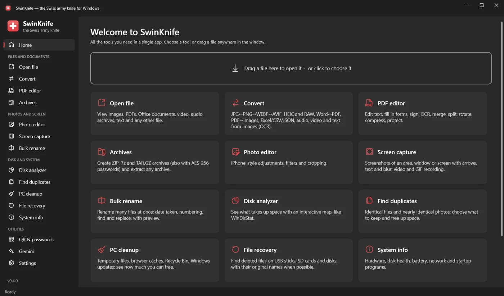
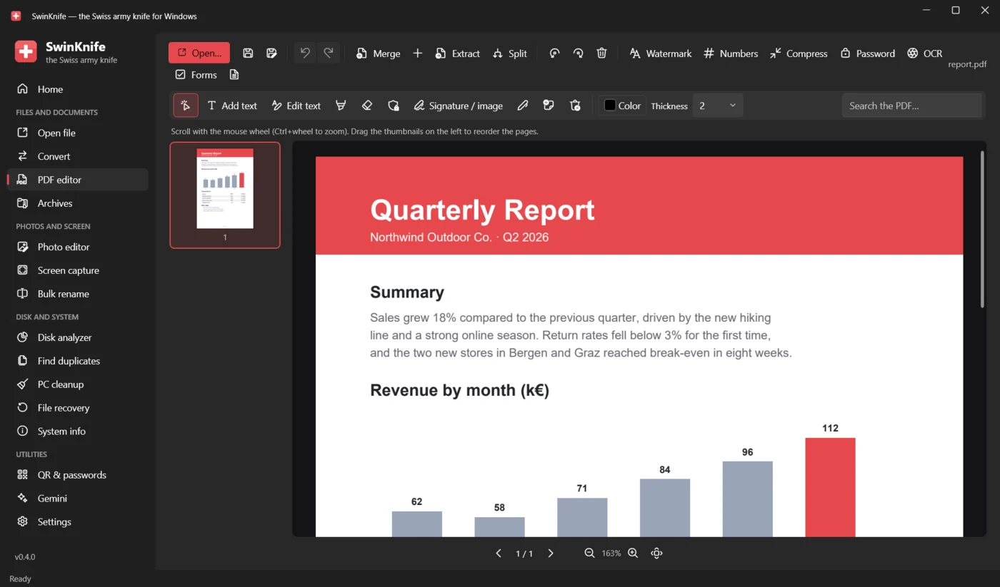
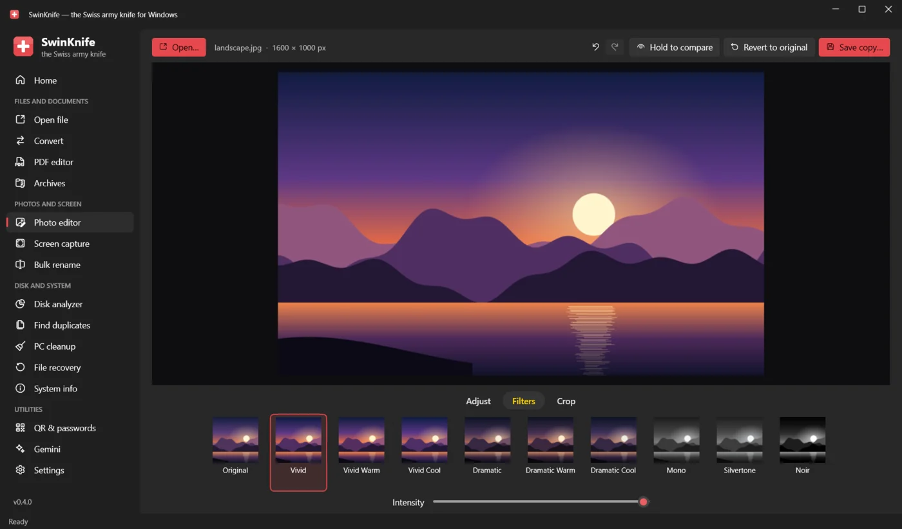
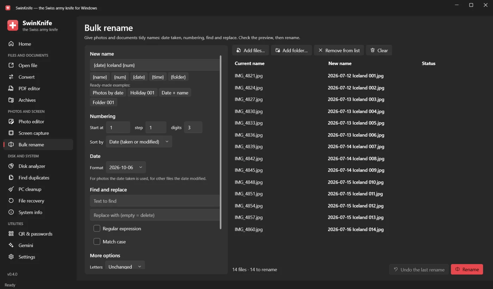
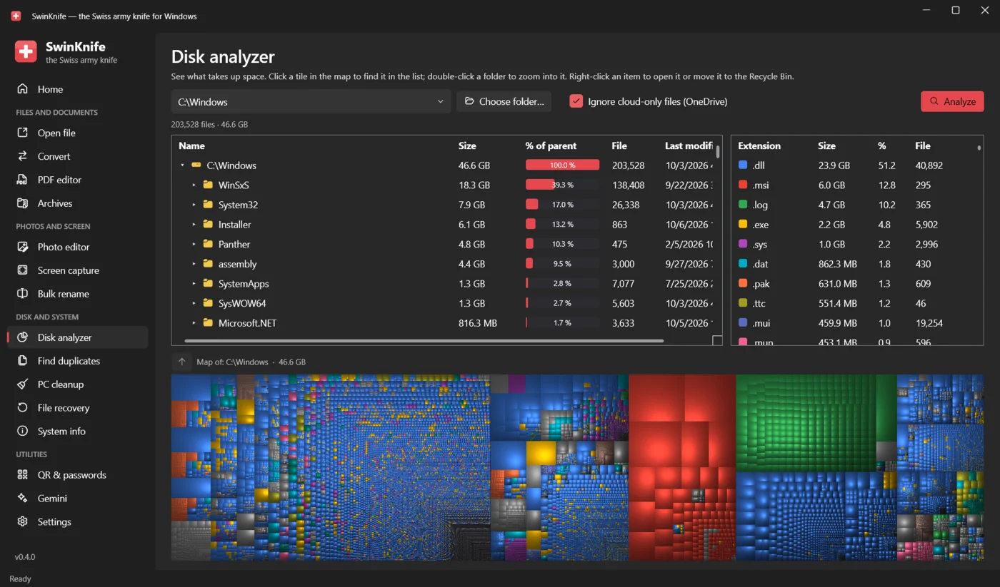

  

<h1 align="center">SwinKnife</h1>

  <b>The Swiss army knife for Windows.</b> 
  Open any file, convert, edit PDFs and photos, capture the screen, find duplicates, recover deleted files and clean up your PC: all in one free app.

  

  <b>English</b> · <a href="README.it.md">Italiano</a> · <a href="README.de.md">Deutsch</a> · <a href="README.es.md">Español</a> · <a href="README.fr.md">Français</a>

  

## Download and install

1. Open the **[latest release](../../releases/latest)** and download **`SwinKnife-Setup-<version>.exe`**.
2. Run it. No administrator rights are needed; you can choose to add SwinKnife to the right-click menu of File Explorer.
3. Start SwinKnife from the Start menu.

> [!NOTE]
> The app is not code-signed yet, so Windows SmartScreen may show *"Windows protected your PC"*.
> Click **More info → Run anyway**. You can check the download against `SHA256SUMS.txt` in the release.

- **Portable version:** download `SwinKnife-<version>-portable.zip`, extract it anywhere and run `SwinKnife.exe`.
- **Updates:** SwinKnife checks for new versions and updates itself with one click (you can also check from *Settings*). Settings are kept.
- **Uninstall:** *Settings → Apps → Installed apps → SwinKnife*.

**Requirements:** Windows 10 (version 1809 or later) or Windows 11, 64-bit. Everything else is included, .NET too.
Optional: Microsoft Office or LibreOffice to convert Word, Excel and PowerPoint files.
FFmpeg (audio, video, screen recording) and 7-Zip (creating .7z archives) are downloaded automatically the first time you need them.

## Screenshots

<table>
  <tr>
    <td> <b>PDF editor</b>: edit text, sign, fill in forms, OCR, merge and split</td>
    <td> <b>Photo editor</b>: adjustments, filters and crop, like on the iPhone</td>
  </tr>
  <tr>
    <td> <b>Bulk rename</b>: date taken, numbering, find and replace, with preview</td>
    <td> <b>Disk analyzer</b>: see what takes up space with a treemap</td>
  </tr>
</table>

## What it can do

### Files and documents
| Tool | What it does |
|---|---|
| **Open file** | Images (also HEIC, AVIF, JPEG XL, PSD, RAW, animated GIF), PDF, XPS, Word/Excel/PowerPoint/ODT, CSV and XLSX as tables, text and code with syntax highlighting, Markdown/HTML with preview, SVG, audio, video, archives, fonts; anything else in hexadecimal. File details, MD5/SHA-256 and **Ask Gemini** (summarize, explain, translate, fix mistakes). |
| **Search files** | Finds any file or folder on all drives instantly as you type, like *Everything*: wildcards (`*.pdf`), `ext:jpg;png`, exclusions (`-draft`), filters by type. As administrator the index is built in seconds from the NTFS file table and stays updated in real time. |
| **Convert** | Images ↔ JPG/PNG/WEBP/AVIF/JPEG XL/BMP/GIF/TIFF/ICO/PDF · Word ↔ PDF/DOCX/ODT/RTF/TXT/HTML · PDF → Word/PNG/JPG/TXT · Excel/CSV/JSON · PowerPoint → PDF/images · Markdown/HTML/TXT → PDF · audio and video · **OCR**: image → text, scanned PDF → searchable PDF. |
| **PDF editor** | Edit existing text, add text, highlighter, whiteout, redaction, signature, drawing, notes; **fill in forms**; **OCR**; merge, split, rotate and reorder pages; watermark, page numbers, compression, AES-256 password; undo/redo. |
| **Translate documents** | Translates whole Word, PowerPoint, Excel, PDF, text and subtitle (.srt) files into 27 languages with Google Gemini, keeping layout, styles and images (needs a free Gemini API key). |
| **Compare** | Line-by-line differences between two files (text, code, Word, PDF…) and between two folders, with copy and sync in either direction. |
| **Archives** | Create ZIP (AES-256 password), 7z (encrypted contents and names) and TAR.GZ; extract ZIP, 7z, RAR, TAR, GZ, BZ2, XZ, password-protected ones too. |

### Photos and screen
| Tool | What it does |
|---|---|
| **Photo editor** | Like the iPhone Photos app: *Adjust* (15 sliders + Auto), *Filters*, *Crop*. Saves a copy and keeps the EXIF data. |
| **Bulk photos** | Resizes and compresses many photos at once for e-mail, chat or web (JPG, WEBP, AVIF, PNG) and removes the GPS location or all hidden data. |
| **Remove background** | Cuts out people, animals and objects automatically with an AI model that runs on your PC; transparent, solid-color or blurred background. |
| **Video editor** | Trim, compress to fit WhatsApp or e-mail limits, extract the audio (MP3/M4A), make GIFs, remove the audio, rotate and join videos. |
| **Screen capture** | Screenshots of an area, a window or the whole screen, with arrows, shapes, highlighter, text, numbered steps and pixelation for sensitive data. Screen recording to **MP4** (with microphone) or **GIF**. |
| **Bulk rename** | Templates with `{name}`, `{num}`, `{date}` (date the photo was taken), `{time}`, `{folder}`; find and replace (regex too), letter case, extensions, accents. Preview, conflict warnings, undo. |

### Disk and system
| Tool | What it does |
|---|---|
| **Disk analyzer** | Like WinDirStat: folders by size, statistics by file type and a treemap. Skips OneDrive cloud-only files. Run as administrator for **fast mode**: it reads the NTFS file table directly, like WinDirStat and WizTree, and scans a whole disk in seconds. |
| **Find duplicates** | Identical files and **similar photos** (recognizes resized or edited copies). Picks what to keep for you, shows previews side by side, moves the rest to the Recycle Bin. |
| **PC cleanup** | Temporary files, Recycle Bin, browser and app caches, thumbnails, error reports, Windows Update leftovers. Shows how much space you get back and the file list before deleting. |
| **Uninstall programs** | Lists installed programs, runs their uninstaller and then finds the folders and registry keys they left behind (with a registry backup). |
| **Secure delete** | Overwrites files and folders before deleting them so recovery tools can't find them, and wipes the free space of a drive. |
| **File recovery** | *Quick, with original names*: NTFS, FAT12/16/32 and exFAT. *Deep scan*: finds files by their content, even after formatting. Read-only; works on disk images too. |
| **System info** | Windows, CPU, RAM, graphics card, disks with S.M.A.R.T. health, battery wear and cycles, network and Wi-Fi, startup programs you can turn on and off, live CPU and memory usage. |
| **Bootable USB** | Write an ISO or IMG to a USB stick to make it bootable, like Rufus (Windows, Linux, boot tools). Back up and restore USB sticks and SD cards as `.img`. Needs administrator rights. |
| **Storage test** | Check whether a USB stick or SD card is genuine and intact, like H2testw: fills the free space with a known pattern and reads it back, unmasking fake-capacity drives. Measures read and write speed. |

### Network
| Tool | What it does |
|---|---|
| **Send to phone** | Exchange photos and files with your phone on the same Wi-Fi: scan a QR code and download or upload from the phone's browser. No app, cable or cloud. |
| **Network & Wi-Fi** | Internet speed test, your Wi-Fi connection and nearby networks with signal and channels (with tips), devices connected to your home network. |
| **Network security** | Reconnaissance tools with a simple interface, to learn and to check **your own** networks: port scan (with an optional nmap front-end), DNS and WHOIS lookup, traceroute, and the open ports on your PC. Each tool shows the equivalent command. |

### Utilities
| Tool | What it does |
|---|---|
| **Terminal** | A real terminal with tabs: PowerShell, Command Prompt, Ubuntu (WSL) and Git Bash, with colors, selection and scrollback. Run `nmap`, `nslookup`, `sudo` (inside WSL) and any command-line tool. |
| **QR & passwords** | QR codes for links, Wi-Fi, contacts, email and SMS, as PNG or SVG. Secure password generator and strength check, all offline. |
| **Quick tools** | Keyboard shortcuts that work in any program: copy text from anywhere on the screen (`Win+Shift+T`), color picker (`Win+Shift+C`), pixel ruler, keep a window always on top (`Win+Ctrl+T`). |
| **Clipboard** | History of everything you copy (text, images, files) to search and paste again; `Win+Alt+V` opens a small window to paste from any program. Content marked as private by password managers is skipped. |
| **Gemini** | Google's AI in a built-in panel that stays signed in, or in Chrome with your existing profile. |
| **Settings** | Language, right-click menu, add-on components, data folder and error log. |

The **right-click menu** in File Explorer (on Windows 11 under *Show more options*) gives quick access to: open, convert,
add to an archive and ask Gemini for any file; edit, compress and OCR for PDFs; edit and convert for images;
extract here for archives; analyze space, find duplicates, rename and compress for folders.

**In the background:** closing the window keeps SwinKnife in the notification area, so shortcuts and clipboard history keep working; in *Settings* you can also start it with Windows or turn this off.

## Privacy

SwinKnife works offline on your PC and collects no data. It goes online only to download FFmpeg or 7-Zip
the first time a tool needs them, and when you use Gemini, which sends your request to Google. Once a day it checks GitHub for a new version (you can turn this off in *Settings*).
The speed test uses Cloudflare's servers, and *Translate documents* sends the text to Google with your own API key. *Send to phone* only works inside your local network. Settings and logs stay in `%LOCALAPPDATA%\SwinKnife`.

## Languages

SwinKnife is available in English, Italian, German, Spanish and French. It uses the Windows language
(English if yours isn't available yet), and you can change it in *Settings*.
Found a clumsy translation or want to add your language? See **[CONTRIBUTING.md](CONTRIBUTING.md#translations)**: it only takes editing a text file.

## For developers

SwinKnife is written in **C# / WPF (.NET 10)** with the Fluent design of Windows 11 ([WPF-UI](https://github.com/lepoco/wpfui)).
To build it, install the .NET 10 SDK and double-click `build.bat`, or run `dotnet run --project src/SwinKnife`.
Code structure, how to add a tool, translations and releases are explained in **[CONTRIBUTING.md](CONTRIBUTING.md)**.

## License

[MIT](LICENSE): free to use, modify and share.
